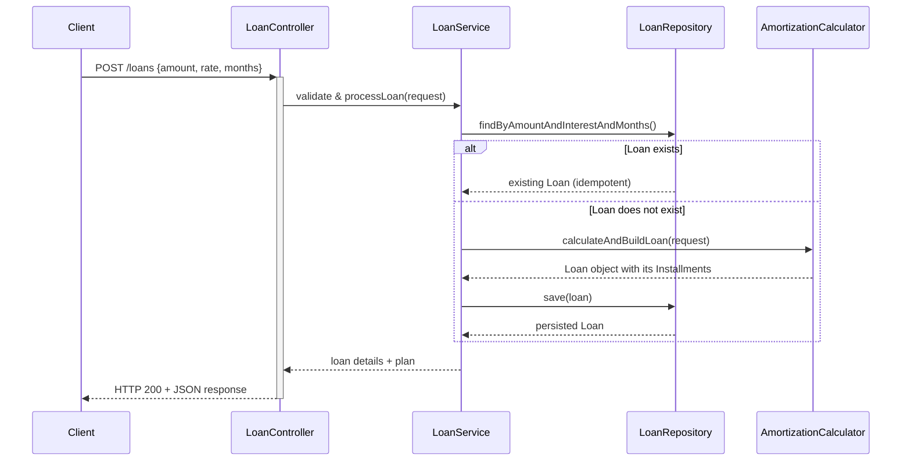

# Loan Calculator

Fintech application for calculating loan amortization schedules. <br><br>


## Table of Contents
- [Prerequisites](#prerequisites)
- [Tech Stack](#tech-stack)
- [Running Application Locally](#running-application-locally)
- [Running Tests](#running-tests)
- [API Contract](#api-contract)
- [Container Diagram](#container-diagram)
- [Class Diagram](#class-diagram)
- [Sequence Diagram](#sequence-diagram)


## Prerequisites
Before you begin, ensure you have the following installed on your system:
- **Java JDK 21** or newer.
- **Docker** and **Docker Compose** to run the required services.


*The project includes a Gradle Wrapper (`gradlew`), so you do not need to install Gradle separately.*

---

## Tech Stack

| Category             | Technology                                       |
|----------------------|--------------------------------------------------|
| **Backend**          | Java 21, Spring Boot, Spring Data JPA, Hibernate |
| **Build Tool**       | Gradle                                           |
| **Database**         | PostgreSQL                                       |
| **Cache**            | Redis                                            |
| **Testing**          | Testcontainers, JUnit 5, Mockito, JaCoCo         |
| **Containerization** | Docker                                           |

---

## Running Application Locally

### On Linux/macOS:
  ```shell
  ./app-start.sh 
  ```
---
### On Windows:
- Build application jar.
  From the project's root directory, run:
  ```shell
  ./gradlew.bat clean bootJar
  ```
- Run all services:
  ```shell
    docker compose up -d
  ```
---
<br>

### Accessing the Application
After successful start you should see 3 Docker containers:
- postgres (DB)
- redis (Cache)
- app: (Loan Calculator Spring Boot App)


Once running, the API will be available at `http://localhost:8080`.

---

### Stopping the Environment

To stop application, run:
```shell
  docker compose down
```  

---
<br>

## Running Tests

- On Linux/macOS:
  ```shell
  ./gradlew test
  ```
- On Windows:
  ```shell
  .\gradlew.bat test
  ```
- **Generate Code Coverage Report:**
    ```shell
    .gradlew jacocoTestReport
    ```
*A code coverage report will be generated by JaCoCo in the `build/reports/jacoco/test/html` directory.*


### Testcontainers
  - IntegrationTests will run with a test PostgreSQL DB and Redis running in a separate Docker containers (via Testcontainers)
  - Containers will be created before tests run and destroyed right after tests finish

---
<br>
  

## API Contract

### Endpoint: `POST /loans`

### Description
- Calculates loan amortization schedule
- Calculated loans and installment plans are persisted in database
- **Idempotent**: identical requests (same amount, interest rate, and duration) return the same persisted loan instead of creating duplicates.
- **Asynchronous**: Loan calculation is an expensive operation (≈ 10 seconds) and is therefore processed asynchronously
- **Cache**: responses are cached to increase performance

### Request
```json
{
  "amount": 1000,
  "annualInterestRate": 5,
  "numberOfMonths": 4
}
```

### Validation rules
- `amount` ≥ 100
- `annualInterestRate` ≥ 3
- `numberOfMonths` ≥ 2

### Validation Error Response
```json
{
    "message": "Validation failed",
    "errorCode": "VALIDATION_ERROR",
    "timestamp": "2025-12-15T04:03:04.114820885",
    "path": "/loans",
    "errors": [
        {
            "field": "amount",
            "rejectedValue": 10,
            "fieldType": "BigDecimal",
            "errorMessage": "Amount must be at least €100"
        }
    ]
}
```


<br>


### Response

#### 1. Status Response (Calculation in progress)
- Returned when the loan calculation has **not finished yet**.
- Indicates that the loan calculation has been accepted and is currently being processed
- Clients may safely retry the same request
- Retrying does not create duplicate loans
- **Cache TTL**: 5 seconds

```json
{
  "loan": {
    "amount": 1000,
    "annualInterestRate": 5,
    "numberOfMonths": 4
  },
  "status": "CALCULATING"
}
```
<br>

#### 2. Full Response (Calculation completed)
- Returned once the loan calculation has finished.
- **Cache TTL**: 10 minutes

```json
{
  "loan": {
    "amount": 1000,
    "annualInterestRate": 5,
    "numberOfMonths": 4
  },
  "status": "DONE",
  "summary": {
    "monthlyPayment": 252.61,
    "totalPayments": 1010.44,
    "totalInterest": 10.44
  },
  "installmentPlan": [
    {
      "period": 1,
      "payment": 252.61,
      "principal": 248.44,
      "interest": 4.17,
      "balance": 751.56
    },
    {
      "period": 2,
      "payment": 252.61,
      "principal": 249.48,
      "interest": 3.13,
      "balance": 502.08
    },
    {
      "period": 3,
      "payment": 252.61,
      "principal": 250.52,
      "interest": 2.09,
      "balance": 251.56
    },
    {
      "period": 4,
      "payment": 252.61,
      "principal": 251.56,
      "interest": 1.05,
      "balance": 0.00
    }
  ]
}
```
---

<br>

## Container Diagram

  ```mermaid

flowchart LR
    User[User / Client]

    App["Loan Calculator Application (Spring Boot)"]
    Postgres[(PostgreSQL Database)]
    Redis[(Redis Cache)]

    User -->|HTTP REST| App
    App -->|JPA / JDBC| Postgres
    App -->|Cache: status & full responses| Redis


  ```


## Class Diagram

  ```mermaid
classDiagram
    class Loan {
        Long id
        Integer version
        BigDecimal amount
        BigDecimal annualInterestRate
        Integer numberOfMonths
        BigDecimal monthlyPayment
        BigDecimal totalPayments
        BigDecimal totalInterest
        List~Installment~ installments
        +addInstallment(Installment)
        +addInstallments(List~Installment~)
    }
    class Installment {
        Long id
        Integer period
        BigDecimal payment
        BigDecimal principal
        BigDecimal interest
        BigDecimal balance
        Loan loan
        +setLoan(Loan)
    }
    Loan  -->  Installment : one to many
```

## Sequence Diagram




<br>

