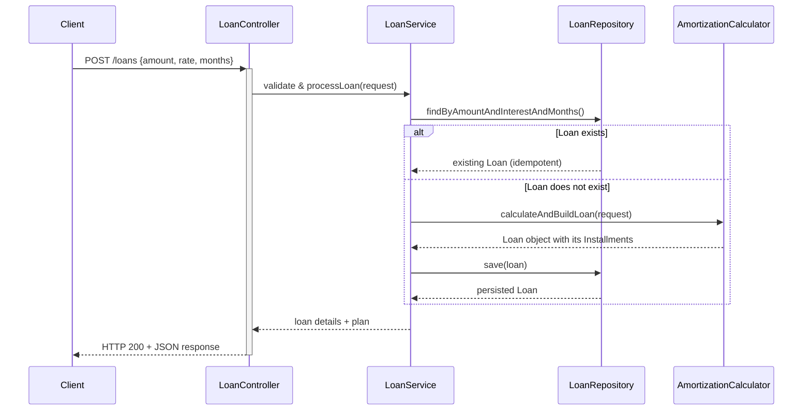

# Loan Calculator

Fintech application for calculating loan amortization schedules. <br><br>


## Table of Contents
- [Prerequisites](#prerequisites)
- [Tech Stack](#tech-stack)
- [Running Application Locally](#running-application-locally)
- [Running Tests](#running-tests)
- [API Contract](#api-contract)
- [Class Diagram](#class-diagram)
- [Sequence Diagram](#sequence-diagram)


## Prerequisites
Before you begin, ensure you have the following installed on your system:
- **Java JDK 21** or newer.
- **Docker** and **Docker Compose** to run the required services.
- An IDE that supports Gradle, like **IntelliJ IDEA**.

*The project includes a Gradle Wrapper (`gradlew`), so you do not need to install Gradle separately.*

---

## Tech Stack

| Category          | Technology                                                  |
| ----------------- | ----------------------------------------------------------- |
| **Backend**       | Java 21, Spring Boot, Spring Data JPA, Hibernate                      |
| **Database**      | PostgreSQL                                                  |
| **Build Tool**    | Gradle                                                      |
| **Testing**       | JUnit 5, Mockito, Testcontainers, JaCoCo                      |
| **Containerization**| Docker                                                      |

---

## Running Application Locally

### 1. Start the Database
First, ensure the Docker daemon is running on your machine. Then, start the PostgreSQL database using Docker Compose.

From the project's root directory, run:
```shell
  docker compose up -d
```
*- The `-d` flag runs the container in detached mode.*

### 2. Run the Spring Boot Application
You can run the application in two ways:

#### Option A: From your IDE (Recommended)

#### Option B: Using Gradle
Use the included Gradle wrapper to build and run the application.

- On Linux/macOS:
  ```shell
  ./gradlew bootRun
  ```
- On Windows:
  ```shell
  .\gradlew.bat bootRun
  ```

### 3. Accessing the Application
Once running, the API will be available at `http://localhost:8080`.

---

### Stopping the Environment

To stop and remove the Docker container for the database, run:
```shell
  docker compose down
```  

---
<br>

## Running Tests

To run the full suite of unit and integration tests, execute the following command:

- On Linux/macOS:
  ```shell
  ./gradlew test
  ```
- On Windows:
  ```shell
  .\gradlew.bat test
  ```
- **Generate Code Coverage Report:**
    ```shell
    .gradlew jacocoTestReport
    ```
*A code coverage report will be generated by JaCoCo in the `build/reports/jacoco/test/html` directory.*


### Integration Tests
  - IntegrationTests will run with a test PostgreSQL DB running in a separate Docker container (via Testcontainers)
  - Container will be created before tests run and destroyed right after tests finish

---
<br>
  

## API Contract

### Endpoint: `POST /loans`

### Description
- Calculates loan amortization schedule
- Calculated loans and installment plans are persisted in database
- **Idempotent**: identical requests (same amount, interest rate, and duration) return the same persisted loan instead of creating duplicates.
- **Asynchronous**: Loan calculation is an expensive operation (≈ 10 seconds) and is therefore processed asynchronously
- **Cache**: responses are cached to increase performance

### Request
```json
{
  "amount": 1000,
  "annualInterestRate": 5,
  "numberOfMonths": 4
}
```

### Validation rules
- `amount` ≥ 100
- `annualInterestRate` ≥ 3
- `numberOfMonths` ≥ 2

### Validation Error Response
```json
{
    "message": "Validation failed",
    "errorCode": "VALIDATION_ERROR",
    "timestamp": "2025-12-15T04:03:04.114820885",
    "path": "/loans",
    "errors": [
        {
            "field": "amount",
            "rejectedValue": 10,
            "fieldType": "BigDecimal",
            "errorMessage": "Amount must be at least €100"
        }
    ]
}
```


<br>


### Response

#### 1. Status Response (Calculation in progress)
- Returned when the loan calculation has **not finished yet**.
- Indicates that the loan calculation has been accepted and is currently being processed
- Clients may safely retry the same request
- Retrying does not create duplicate loans

```json
{
  "loan": {
    "amount": 1000,
    "annualInterestRate": 5,
    "numberOfMonths": 4
  },
  "status": "CALCULATING"
}
```
<br>

#### 2. Full Response (Calculation completed)
- Returned once the loan calculation has finished.
- Cache: response is cached with 10 minutes lifespan

```json
{
  "loan": {
    "amount": 1000,
    "annualInterestRate": 5,
    "numberOfMonths": 4
  },
  "status": "DONE",
  "summary": {
    "monthlyPayment": 252.61,
    "totalPayments": 1010.44,
    "totalInterest": 10.44
  },
  "installmentPlan": [
    {
      "period": 1,
      "payment": 252.61,
      "principal": 248.44,
      "interest": 4.17,
      "balance": 751.56
    },
    {
      "period": 2,
      "payment": 252.61,
      "principal": 249.48,
      "interest": 3.13,
      "balance": 502.08
    },
    {
      "period": 3,
      "payment": 252.61,
      "principal": 250.52,
      "interest": 2.09,
      "balance": 251.56
    },
    {
      "period": 4,
      "payment": 252.61,
      "principal": 251.56,
      "interest": 1.05,
      "balance": 0.00
    }
  ]
}
```
---

<br>

## Class Diagram


  ```mermaid
classDiagram
    class Loan {
        Long id
        Integer version
        BigDecimal amount
        BigDecimal annualInterestRate
        Integer numberOfMonths
        BigDecimal monthlyPayment
        BigDecimal totalPayments
        BigDecimal totalInterest
        List~Installment~ installments
        +addInstallment(Installment)
        +addInstallments(List~Installment~)
    }
    class Installment {
        Long id
        Integer period
        BigDecimal payment
        BigDecimal principal
        BigDecimal interest
        BigDecimal balance
        Loan loan
        +setLoan(Loan)
    }
    Loan  -->  Installment : one to many
```

## Sequence Diagram




<br>

