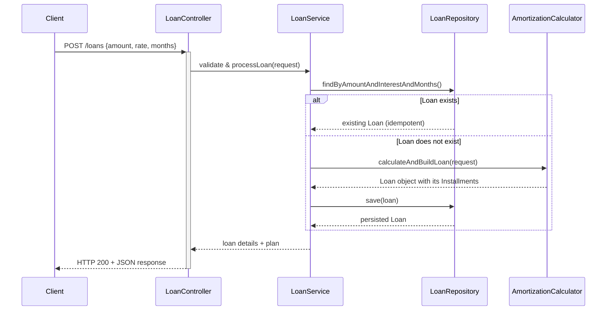

# Loan Calculator

Fintech application for calculating loan amortization schedules. <br>


## Table of Contents
- [Prerequisites](#prerequisites)
- [Tech Stack](#tech-stack)
- [Running Application Locally](#running-application-locally)
- [API Contract](#api-contract)
- [Class Diagram](#class-diagram)
- [Sequence Diagram](#sequence-diagram)
- [Testing and Coverage](#testing-and-coverage)

## Prerequisites
- Java 21+
- Docker 28.3.2 or higher (required for PostgreSQL and Testcontainers)
- IDE (IntelliJ IDEA recommended)

## Tech Stack

- Java 21
- Spring Boot
- Spring Data JPA (Hibernate)
- Gradle
- Docker

- PostgreSQL

- Testcontainers
- JUnit 5, Mockito 
- JaCoCo

## Running Application Locally
1. make sure that `Docker` is running
2. from project root run: `docker compose up -d` to start the Database
3. start application
    - from IntelliJ IDEA
    - or via gradle by running: `./gradlew bootRun` (Linux / Mac) or `./gradlew.bat bootRun` (Windows)

## API Contract

### Endpoint: POST `/loans`

### Description
- Calculates loan amortization schedule
- Calculated loans and installment plans are persisted in database
- **Idempotent**: identical requests (same amount, interest rate, and duration) return the same persisted loan instead of creating duplicates.


### Request
```json
{
  "amount": 1000,
  "annualInterestRate": 5,
  "numberOfMonths": 4
}
```

### Validation rules
- `amount` ≥ 100
- `annualInterestRate` ≥ 3
- `numberOfMonths` ≥ 2

### Validation Error Response
```json
{
    "message": "Validation failed",
    "errorCode": "VALIDATION_ERROR",
    "timestamp": "2025-12-15T04:03:04.114820885",
    "path": "/loans",
    "errors": [
        {
            "field": "amount",
            "rejectedValue": 10,
            "fieldType": "BigDecimal",
            "errorMessage": "Amount must be at least €100"
        }
    ]
}
```


<br>


### Response
```json
{
  "loan": {
    "amount": 1000,
    "annualInterestRate": 5,
    "numberOfMonths": 4
  },
  "summary": {
    "monthlyPayment": 252.61,
    "totalPayments": 1010.44,
    "totalInterest": 10.44
  },
  "installmentPlan": [
    {
      "period": 1,
      "payment": 252.61,
      "principal": 248.44,
      "interest": 4.17,
      "balance": 751.56
    },
    {
      "period": 2,
      "payment": 252.61,
      "principal": 249.48,
      "interest": 3.13,
      "balance": 502.08
    },
    {
      "period": 3,
      "payment": 252.61,
      "principal": 250.52,
      "interest": 2.09,
      "balance": 251.56
    },
    {
      "period": 4,
      "payment": 252.61,
      "principal": 251.56,
      "interest": 1.05,
      "balance": 0.00
    }
  ]
}
```

<br><br>

## Class Diagram


  ```mermaid
classDiagram
    class Loan {
        Long id
        Integer version
        BigDecimal amount
        BigDecimal annualInterestRate
        Integer numberOfMonths
        BigDecimal monthlyPayment
        BigDecimal totalPayments
        BigDecimal totalInterest
        List~Installment~ installments
        +addInstallment(Installment)
        +addInstallments(List~Installment~)
    }
    class Installment {
        Long id
        Integer period
        BigDecimal payment
        BigDecimal principal
        BigDecimal interest
        BigDecimal balance
        Loan loan
        +setLoan(Loan)
    }
    Loan  -->  Installment : one to many
```

## Sequence Diagram




<br>

## Testing and Coverage

- **Run all tests:**
    ```sh
    .gradlew test
    ```
- **Generate Code Coverage Report**
    ```sh
    .gradlew jacocoTestReport
    ```
Then open `build/reports/jacoco/test/html/index.html` to view report.


- **Integration Tests:**
  - IntegrationTests will run with a test DB running in a separate Docker container (via Testcontainers)
  - Container will be created before tests run and destroyed right after tests finish